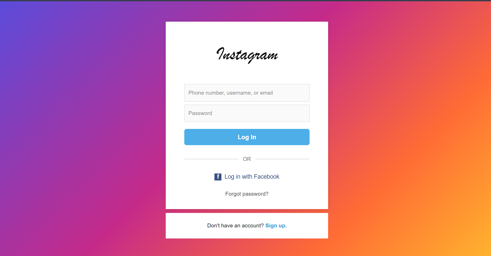
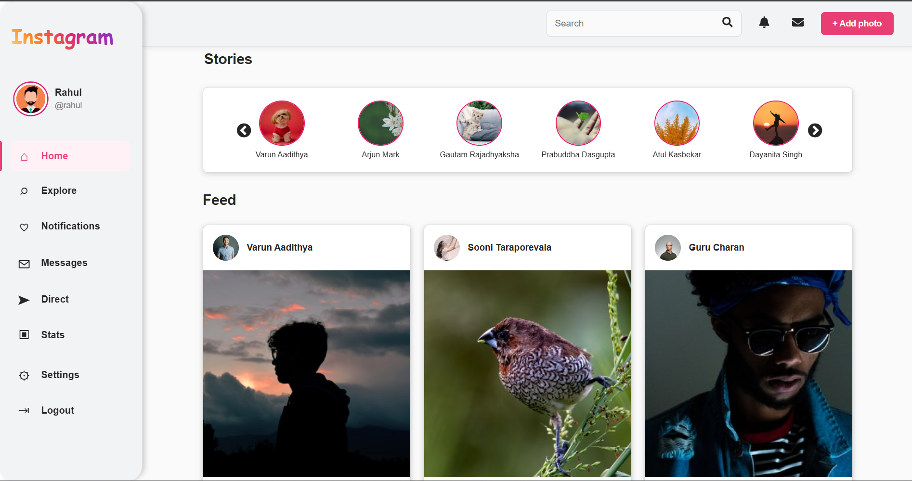
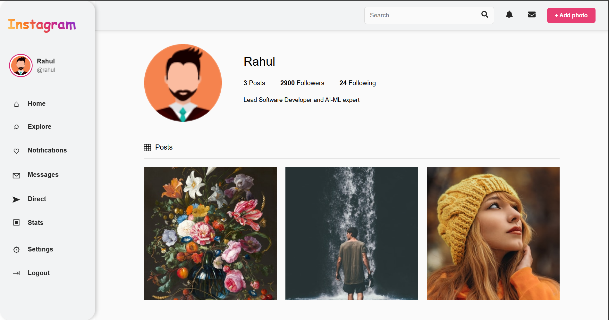
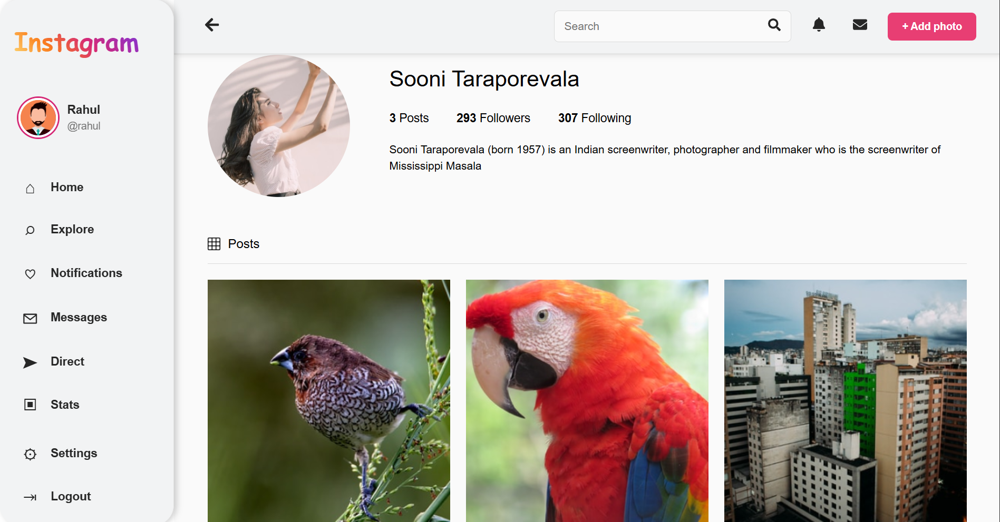

# Instagram Clone

A responsive Instagram-inspired social media web application built with React.js. The project recreates the core Instagram experience with authentication, stories, posts, search, comments, and user profiles.

## Preview
##Login Page


##Home Page


##Profile Page


##Post Page


## Features

- User login and authentication
- Home feed with posts
- Stories slider with story viewing modal
- Like and comment interactions
- Search functionality
- User profile and other user details
- Protected routes
- Loading and error handling
- Responsive user interface

## Tech Stack

- React.js
- JavaScript
- HTML5
- CSS
- React Router
- REST APIs
- Vite

This project uses REST APIs provided for the Insta Share application to retrieve users, stories, posts, profiles, and related data.
Project Highlights
A component-based React application demonstrating REST API integration, authentication, routing, state management, reusable components, and responsive UI design.
Install the dependecies : npm install
Start the development server:  npm run dev

## Getting Started

Clone the repository:

```bash
git clone https://github.com/Lasya0413/Frontend-Project-.git
